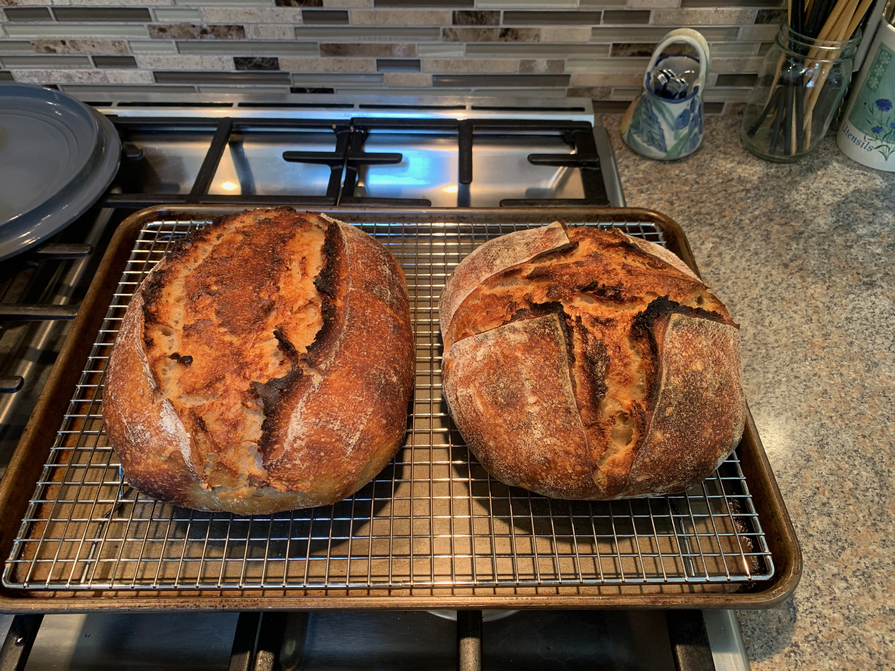
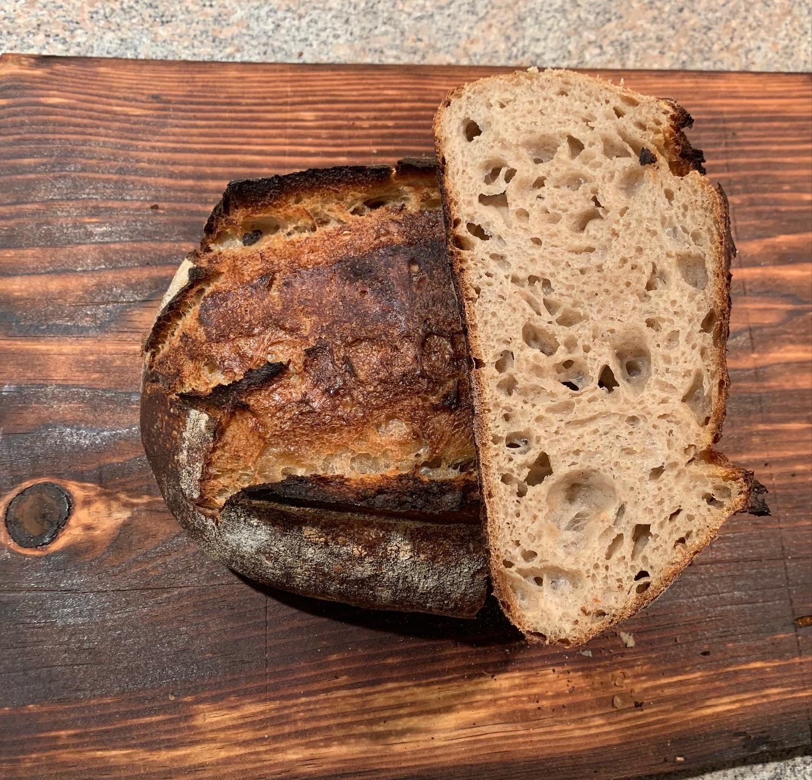

## The Path to Sourdough

Dough and fermentation became a pretty heavy hobby for me during the pandemic,
and I know I'm not alone. All that time being stuck at home (I wasn't
necessarily complaining) and you start exploring things, and for me that thing
was dough and fermentation. It turns out, much like writing software, it's just
a constant process of iteration, variables, debugging, and using your hands.

Fortunately, I've always spent a lot of time in the kitchen, as I've always
enjoyed cooking. However, there's a big difference between cooking a steak and
nailing the fermentation of a dough. Initially, I spent most of my time making
pizza, and regularly using active dry yeast and leavens (usually a poolish).

## How it started

My first endeavour into creating a sourdough starter was a complete failure, I
spent a week, twice a day, trying to create a starter but something went wrong
and it just smelled rotten. Desperate to give it another shot I decided to ask
my local bakery for some of their starter, and to my surprise they were happy to
oblige. (Huge shout out to Working Culture Bakery - they are incredible). I'm
fairly confident that a lot of bakeries are happy to share some starter (some at
a cost), if you want to give it a try.

Eventually, I picked up a copy of the first
[Tartine](https://www.indigo.ca/en-ca/tartine-bread/9780811870412.html) book and
went to work. Going from commercially made yeasts to sourdough was a huge
challenge. Generally, commercial yeasts are extremely forgiving and consistent.
Leavens take time to learn and tame, but after a while you start to understand
your starter and how it reacts to temperature, flours, time, and seasons. For
the most part, I now stick to creating my leaven the anywhere from 10 - 12 hours
before I make a dough, with roughly 10% of starter at an ambient room
temperature between 18 - 20c.

## Our Family's Country Loaf

I tend to bake twice a month, with two loaves per bake. My go-to recipe doesn't
steer too far from the Tartine country loaf percentages, but the process has
been adapted to work for me. Dough can be a lot of work - it's the main
complaint of many people who tried and gave up. As such, I've adapted to an
overnight bulk fermentation at room temperature, then shaping in the morning
followed by cold fermenting for 24 hours. This generally reduces my overall
workload during the day, and results in both great fermentation and flavour. I
also tend to use, on average, 20% whole wheat flour &amp; 80% bread flour and
pretty much exclusively organic local(ish) flour. I find that not only does this
improve fermentation, but it increases flavour and digestibility.

## The Recipe

### Baker's Percentages

| Item              | Percentage | Weight |
| :---------------- | ---------: | -----: |
| Total Flour       |       100% |  1000g |
| Bread Flour       |        75% |   750g |
| Whole Wheat Flour |        25% |   250g |
| Leaven            |        10% |   100g |
| Water             |        75% |   750g |
| Salt              |         2% |    20g |

### Notes on Ingredients

Flour is the variable that is easiest to modify for biggest changes in flavour.
My go-to bread flour is
[Anita's Organic Mill Flour](https://www.anitasorganic.com/products-anitas/unbleached-all-purpose-white-flour).
It's accessible in most grocery stores in Victoria, and after being acquired by
Nature's Path it's probably accessible across Canada, by now.

The whole wheat flour is where you can have fun. Personally, I really enjoy
[Flourist](https://flourist.com) flour as it's local and easy to pick up
whenever we are on the mainland.

I don't do any fancy filtering for my water. We are very lucky to have some
great tap water in Victoria.

### Initial Mix and Fermentolyse

As mentioned, I generally make my leaven first thing in the morning, roughly 10
to hours before mixing the dough.

Once it's ready, I'll fill my mixing bowl with my water, leaven, and flour. I'll
mix by hand until all of the dough is relatively hydrated and there are no dry
bits. I will let this fermentolyse, as I generally didn't see much difference by
doing an autolyse without the leaven. However, I explicitly do not mix salt at
this point.

Adding salt too early to sourdough can inhibit yeast and bacterial activity,
slowing down fermentation and potentially affecting the development of flavor
and structure in your bread. Although I am a fan of reducing steps, I find this
one to be pretty crucial. Salt is powerful, think of using it on a steak or a
lacto-ferment and how effective it is.

Autolyse is the process of hydrating your flour with the water in your recipe.
Fermentolyse is a lazy man's autolyse by also adding your leaven to start your
fermentation. I personally find this step critical, as it rapidly improves
overall gluten development.

### Add Salt

After letting the dough fermentolyse for 30 minutes to an hour, I add the salt
and do a relatively aggressive hand mix. The benefits of hand-mixing is that you
can get a good feel of when the salt is integrated. Once it's integrated, after
anywhere from 5 to 10 minutes of hand-mixing, I let the dough rest for 30
minutes.

### Stretch and Coil Folds, Bulk Ferment

After the 30 minute rest, I do the first and only stretch and fold. This is
where you pull a quarter of the dough and fold it over itself. I will do this
anywhere between 4 to 8 times, depending on how stretchy and forgiving the dough
is.

After the first stretch and fold, I'll perform coil folds where you fold half of
the dough over itself, rotate it 90 degrees, and do the same thing 3 more times.
I will then let it rest for another 30 to 45 minutes and perform 2 more coil
folds.

Generally, these folds will have the biggest impact on gluten development, and
will result in some great loaves, so I don't recommend skipping them. Also, this
helps ensure the temperature isn't vastly different in some parts of the dough
compared to others.

After the final fold I leave the dough counter, and a covered container, to bulk
ferment.

### Shaping

The dough will bulk ferment overnight and will double in size. I'll carefully
remove the dough from the container and let it rest on the counter from anywhere
between 10 to 20 minutes. A big lesson in dough is that it's important to let
the gluten relax between handling it. It becomes much more relax and forgiving.

After it rests I'll divide it in half and preshape it with bench knife by
pushing it towards me, allowing the friction of the counter to tighten the
dough. There are many youtube videos on this technique! After letting it rest
again, I’ll then complete the final shape and place it into my banneton. At this
point, it goes into the fridge while being covered until the next morning.

### The Bake

The next morning, I'll remove the bannetons from the fridge and fit two dutch
ovens in my oven, and preheat it to 475 degrees. Some recipes recommend
pre-heating it for an hour but generally I find it to have no major improvement
on the bake.

Once the oven is preheated, I'll place the shaped doughs onto parchment paper
and score it. I'll carefully place them into the preheated dutch ovens, where
I'll add a couple of ice cubes. Then I'll cover the dutch ovens and place them
back into the oven and drop the temperature to 450 degrees.

The ice cubes contribute to the overall rise of the dough during the bake, as
well as the covered dutch oven. Unlike a commercial oven, I lack a steam option
but this is a common technique for baking bread at home to produce a similar
effect.

After 20 minutes, I'll remove the lid and continue to bake it for another 20
minutes.

## The Finished Product

Finally, we are done. The bread is cooked. Collectively, this takes about an
hour or more of hands-on work, and a significant amount of waiting. But the
product is worth it - we look forward to a week of sandwiches whenever we make
bread. The house smells incredible and we have multiple meals where we don't
need to stress about what we're eating.

Ultimately, every loaf is different. Whether that's because I used different
flour, or the ambient temperature and humidity at the time has deviated from the
norm. But, that's the adventure.
